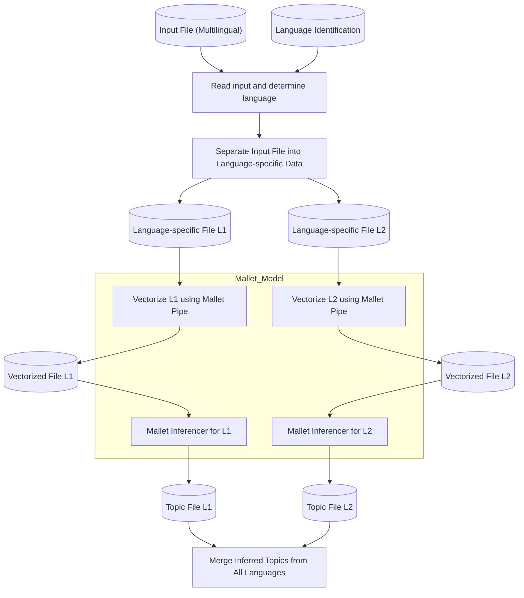

# Mallet topic inference

## Introduction

## Prerequisites

The build process has been tested on modern Linux and macOS systems and requires
Python 3.11.

This repository also requires GNU Make 4 or later. On macOS, the system `make`
is often GNU Make 3.81. Install a newer GNU Make and either alias `make` to it
or replace `make` ad hoc with `gmake` when running commands.

### Ubuntu/Debian

Make sure to have the following packages installed:

```sh
# install python3.11 according to your OS
sudo apt update
sudo apt upgrade -y
which python3.11 || \
   { sudo add-apt-repository ppa:deadsnakes/ppa && sudo apt update && sudo apt install python3.11 -y && sudo apt install python3.11-distutils -y ; }
python3.11 -mpip help > /dev/null || { curl -sS https://bootstrap.pypa.io/get-pip.py | python3.11 ; }
sudo apt install git git-lfs make moreutils coreutils parallel # needed for building
sudo apt install openjdk-17-jre-headless # needed for mallet runtime
```

### macOS

Install the required dependencies using Homebrew:

```sh
# Install Homebrew if not already installed
# See https://brew.sh for installation instructions

# Install required packages
brew install python@3.11 git git-lfs make coreutils parallel
brew install openjdk@17  # or newer versions (openjdk@23 also works)
brew install ninja ant   # required for building jpype1

# Set JAVA_HOME environment variable (required for jpype1)
export JAVA_HOME=$(/usr/libexec/java_home)
# Add this to your ~/.zshrc or ~/.bash_profile to make it permanent:
echo 'export JAVA_HOME=$(/usr/libexec/java_home)' >> ~/.zshrc
```

### Installing Python Dependencies

This repository uses `pipenv`.

```sh
git lfs install   # must run once per machine before cloning
git clone --recursive https://github.com/impresso/impresso-mallet-topic-inference.git
cd impresso-mallet-topic-inference
git lfs pull      # fetch large model artifacts (inferencers, pipes, vocabularies)
python3.11 -mpip install pipenv
python3.11 -mpipenv install
python3.11 -mpipenv shell
```

Compatibility note:

- `spacy==3.6.0` requires `smart-open<7.0.0,>=5.2.1`.
- If your active environment contains `smart-open==7.6.0`, it is incompatible with the pinned spaCy version used by this repository.
- This repository pins `smart-open==6.4`, so if your `.venv` has drifted to `7.6.0`, reinstall the locked dependencies before running the pipeline.

## Orchestration

This repository is orchestrated through the Make-based cookbook under [`cookbook/`](./cookbook). The top-level `Makefile` composes setup, synchronization, processing, and cleanup targets from the cookbook fragments.

Typical entry points are:

- `make setup`: prepare the local environment and build directories
- `make newspaper NEWSPAPER=...`: process one newspaper
- `make collection`: process multiple newspapers in parallel
- `make sync`, `make sync-input`, `make sync-output`: synchronize local stamp state with S3
- `make clean-sync`, `make clean-build`: remove local sync state or the full build directory

On macOS, read `make` in the examples below as “your GNU Make 4+ command”, whether that is an alias to Homebrew make or `gmake`.

If you use run-specific configuration files, prefer:

```sh
make newspaper CFG=configs/config-topics-tm-mallet_infer_seed42_v3.0.0-multilingual_v3-0-0.mk
```

Configuration modes:

- `config.local.mk`: local default overrides for one machine; loaded automatically when present
- `CFG=configs/<file>.mk`: explicit run-specific configuration for a particular processing run

Use `CFG=...` when you want a reproducible named run configuration. Use `config.local.mk` for machine-local defaults such as preferred buckets, logging, or local execution settings.

For the full orchestration model, including local stamp files, distributed multi-machine processing, S3 synchronization strategy, parallelization variables such as `COLLECTION_JOBS` and `NEWSPAPER_JOBS`, and the broader cookbook target catalog, see [`cookbook/README.md`](./cookbook/README.md).

## Model Artifacts

All large binary artifacts are tracked with **Git LFS**. Run `git lfs install` before cloning and `git lfs pull` if the binaries are missing after a fresh clone.

Each language model lives under `models/tm/`. Legacy v2 models consist of five files:

| File                                                         | Purpose                                                  | LFS     |
| ------------------------------------------------------------ | -------------------------------------------------------- | ------- |
| `tm-{lang}-all-v{x}.config.json`                             | Model configuration (language, UPOS filter, topic count) | no      |
| `tm-{lang}-all-v{x}.inferencer`                              | Mallet inferencer binary used by the inference step      | **yes** |
| `tm-{lang}-all-v{x}.pipe`                                    | Mallet vectorizer pipe used by the vectorization step    | **yes** |
| `tm-{lang}-all-v{x}.vocab.lemmatization.tsv.gz`              | Lemmatization vocabulary applied before vectorization    | **yes** |
| `tm-{lang}-all-v{x}.topic_model_topic_description.jsonl.bz2` | Human-readable topic descriptions (reference only)       | **yes** |

v3 models use the normalized lemma vocabulary schema. Their config declares
`schema_version: "3.0"`, `preprocessing.mode: "normalized-lemma-vocab-v1"`, and
the required artifacts. For v3 inference the code uses the input lemma, applies
the model's `*.char-normalization.json`, filters against `*.vocab.tsv.bz2`, and
then lets the MALLET pipe ignore any remaining out-of-pipe terms. The v3 bundle
therefore does not require `*.vocab.lemmatization.tsv.gz`.

v3 models require MALLET 2.1.0. If `mallet-2.1.0/` is not vendored in this
repository, set `TOPICS_MALLET_HOME` or `MALLET_HOME` to the local MALLET 2.1.0
directory.

Currently included models:

| Language      | Model ID         | Config variable    |
| ------------- | ---------------- | ------------------ |
| German        | `tm-de-all-v2.0` | `TOPICS_DE_CONFIG` |
| French        | `tm-fr-all-v2.0` | `TOPICS_FR_CONFIG` |
| Luxembourgish | `tm-lb-all-v2.1` | `TOPICS_LB_CONFIG` |
| German        | `tm-de-all-v3.0` | `TOPICS_DE_CONFIG` |
| French        | `tm-fr-all-v3.0` | `TOPICS_FR_CONFIG` |
| English       | `tm-en-all-v3.0` | `TOPICS_EN_CONFIG` |
| Luxembourgish | `tm-lb-all-v3.0` | `TOPICS_LB_CONFIG` |

The v2 Mallet runtime (`mallet/lib/mallet.jar` and `mallet/lib/mallet-deps.jar`) and the v3 MALLET 2.1.0 runtime under `mallet-2.1.0/` are also LFS-tracked and must be present before running the corresponding `make` targets.

For a v2.0.1 multilingual run, the reference config is [`configs/config-topics-tm-mallet_infer_seed42_v2.0.1-multilingual_v2-0-1.mk`](./configs/config-topics-tm-mallet_infer_seed42_v2.0.1-multilingual_v2-0-1.mk). It wires the three per-language configs above and sets the input lingproc run, output S3 bucket, and run version.

For a v3.0.0 multilingual run, use [`configs/config-topics-tm-mallet_infer_seed42_v3.0.0-multilingual_v3-0-0.mk`](./configs/config-topics-tm-mallet_infer_seed42_v3.0.0-multilingual_v3-0-0.mk). It wires `de fr en lb` to the v3 configs, records the expected linguistic-processing run family, and writes outputs under `topics-tm-mallet_infer_seed42_v3.0.0-multilingual_v3-0-0`.

## Data flow

The data processing flow begins with reading a multilingual input file and using language identification to determine
each content item's language. The input data is then separated into language-specific temporary files, labeled as L1 and L2. Each file
undergoes vectorization using its language-specific Mallet pipe, creating corresponding vectorized files. These vectorized files are then
used by language-specific inferencers to extract topics, resulting in topic-specific files for each language. Finally,
the language-specific topic files are merged to create a single unified topic file. The Mallet model encompasses both
the vectorization and inferencing processes for each language.



## Topics S3 Control

The topic inferencer itself no longer manages S3 output behavior. It may read input
from S3, but dry-run, skip-if-output-exists, overwrite, WIP lock handling, and final
upload are controlled by the surrounding cookbook rule in `cookbook/processing_topics.mk`.

For topic-processing runs, prefer these topics-specific Make variables:

- `TOPICS_DRY_RUN_OPTION`: set to `--s3-output-dry-run` to keep processing local and skip S3-side WIP and uploads.
- `TOPICS_FORCE_OVERWRITE_OPTION`: set to `--force-overwrite` to replace an existing S3 topics result.
- `TOPICS_SKIP_IF_OUTPUT_EXISTS_OPTION`: set to `--quit-if-s3-output-exists` to skip work when the S3 output already exists.
- `TOPICS_KEEP_TIMESTAMP_ONLY_OPTION`: set to `--keep-timestamp-only` to keep only timestamp stubs locally after upload.

Example:

```sh
# Dry-run topics processing without any S3-side writes
make topics-target \
    TOPICS_DRY_RUN_OPTION=--s3-output-dry-run

# Force replacement of an existing topics output on S3
make topics-target \
    TOPICS_FORCE_OVERWRITE_OPTION=--force-overwrite
```

## Releases

For the release workflow, follow [RELEASE_PROCESS.md](./RELEASE_PROCESS.md).

Repository-specific rule: update and commit [RELEASE.md](./RELEASE.md) before tagging, with the newest release first, then create the GitHub release from that committed content so the tag, repository contents, and published release notes stay in sync.
