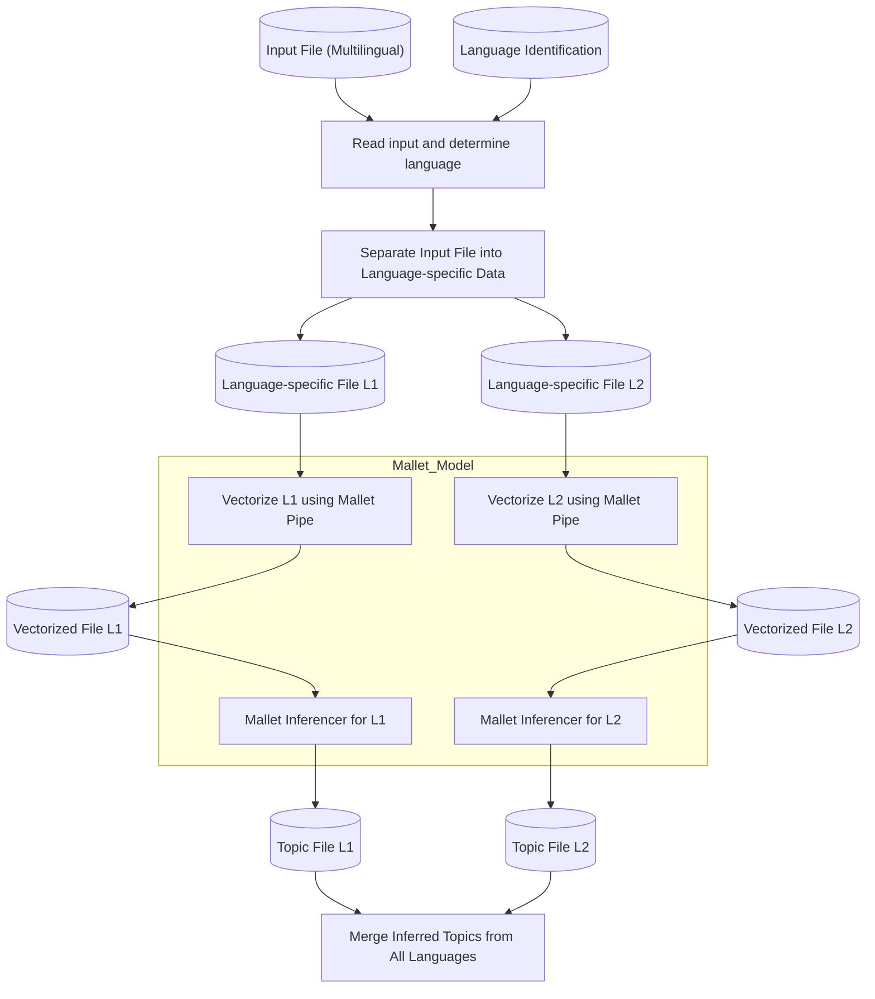

# Mallet topic inference

## Introduction

## Prerequisites

The build process has been tested on modern Linux and macOS systems and requires
Python 3.11. Under Ubuntu/Debian
, make sure to have the following packages installed:

```sh
# install python3.11 according to your OS
sudo apt update
sudo apt upgrade -y
which python3.11 || \
   { sudo add-apt-repository ppa:deadsnakes/ppa && sudo apt update && sudo apt install python3.11 -y && sudo apt install python3.11-distutils -y ; }
python3.11 -mpip help > /dev/null || { curl -sS https://bootstrap.pypa.io/get-pip.py | python3.11 ; }
sudo apt install git git-lfs make moreutils coreutils parallel # needed for building
sudo apt install openjdk-17-jre-headless # needed for mallet runtime
```

This repository uses `pipenv`.

```sh
git clone https://github.com/impresso/impresso-linguistic-processing.git
cd impresso-linguistic-processing
python3.11 -mpip install pipenv
python3.11 -mpipenv install
python3.11 -mpipenv shell
```

## Data flow

The data processing flow begins with reading a multilingual input file and using language identification to determine
each content item's language. The input data is then separated into language-specific temporary files, labeled as L1 and L2. Each file
undergoes vectorization using its language-specific Mallet pipe, creating corresponding vectorized files. These vectorized files are then
used by language-specific inferencers to extract topics, resulting in topic-specific files for each language. Finally,
the language-specific topic files are merged to create a single unified topic file. The Mallet model encompasses both
the vectorization and inferencing processes for each language.


